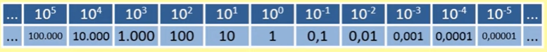

## Potência de Base 10
* É um número com base 10 elevado a um expoente inteiro ***n***.
* Para expoente positivo resulta em 1 seguido de ***n*** zeros e para expoente negativo resulta em 1 precedido de ***n*** zeros.

    

 
 
 
 
 

> #### ADIÇÃO E SUBTRAÇÃO DE POTÊNCIA DE BASE 10
* A adição ou subtração, só ocorre se os expoentes forem iguais.
* Se forem diferentes é preciso iguala-los antes de realizar a operação de soma ou subtração.
* O cálculo é feito repetindo as bases e somando ou subtraindo as partes inteiras.

Ex: 104 + 104 = 2 . 104  
Ex: 4,1 . 103 - 2,1 . 103 = 2 . 103  

## Notação Científica
* É uma forma de representar números muito grandes ou muito pequenos usando o produto de potência de base 10.
* Ele é representado por dois fatores:
  - x = a . 10n
  - 1º Número decimal ***a***, em que 1 =< a < 10
  - 2º Potência de base 10 com expoente inteiro
* Calculo:
  - representa a parte decimal com a vírgula 
  - conta o número de casas após a virgula
  - para números menores que 1 o expoente é negativo
  - para números maiores que 1 o expoente é positivo

Ex: 24500000 = 2,45 . 107
* 2,4500000 => 2,45 com 7 casas após a vírgula

Ex: 0,000456 = 4,56 . 10-4
* 00004,56 => 4,56 a vírgula andou 4 casas pra direita

> #### ORDEM DE GRANDEZA
* Para a . 10n a sua ordem de grandeza será:
  - 10n se ***a*** < 3,16
  - 10n + 1 se ***a*** > 3,16
  
Ex: 2,45 = 2,45 . 100 ordem de grandeza = 100  
Ex: 34,5 = 3,45 . 101 ordem de grandeza = 101 + 1 = 102