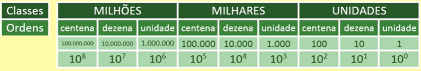
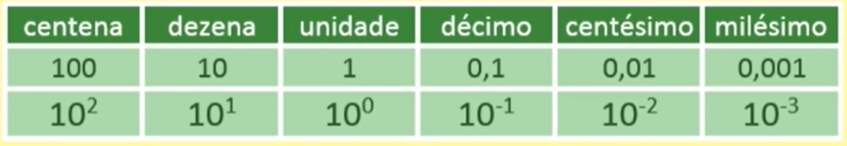

## Sistema de Numeração Decimal
* Também chamado de sistema hindu-arábico, sendo um sistema de base 10.
* O sistema decimal é um sistema posicional, ou seja, um mesmo algarismo muda de valor depedendo de sua posição.
* O algarismo 0, representa a ausência de um valor (nada).
* As quantidades são agrupadas de 10 em 10.
* Representação do sistema decimal:
 - 0, 1, 2, 3, 4, 5, 6, 7, 8, 9

Ex: 1111 => 1 unidade, => 1 dezena, => 1 centena, => 1 milhar

> #### CLASSES E ORDENS
* Todo número inteiro é subdivivido em classes e cada classe possui três ordens.
* Classes:
  - unidades
  - milhares
  - milhões
  - etc
* Ordens:
 - unidade
 - dezena
 - centena

Ex: 84.506

    

 
 
 
 
 

> #### REPRESENTAÇÃO DECIMAL

    

